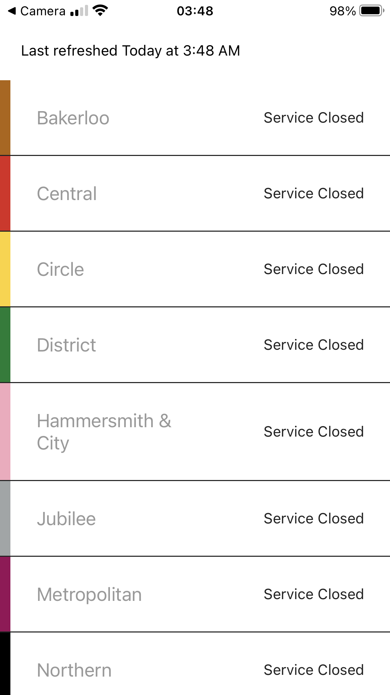

    

# Description
This is an iOS app build with [React Native](https://reactnative.dev/) and [Expo](https://docs.expo.io/get-started/installation/) to display the current TFL tube line statuses and allows you to refresh by pulling.

## Requirements

- Node Version LTS (v. 14) - You can install it using `nvm`
- Expo CLI globally installed - `npm install --global expo-cli`

## Instructions

1. To build the app you would need to clone it and run `yarn`.
2. Once installed you can run `yarn run start` which will bring up the expo metro bundler.
From here you got a couple of options to run the app on different . It's currently only been tested for iOS.
3. Run on your iOS simulator (Xcode) or download the Expo Go app (from the Google Play Store or iOS App Store) and scan the QR code using your camera. This will open up the app with Expo Go.

## To Do

- Write Unit and Component Tests
- Create Snapshots tests
